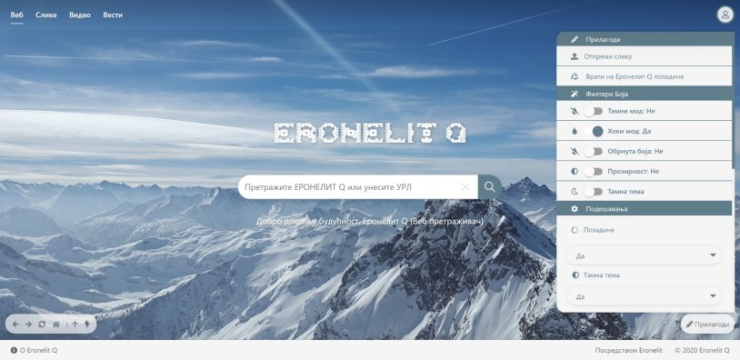

### Hi there, I'm [Marko!](https://github.com/marko9827) 👋
 
 | Instagram    | Linkedin    |
| ----------- | ----------- |
| [ ](https://instagram.com/nikoliccc02)  | [](https://www.linkedin.com/in/markonikolic98/)  |
 - 🔢 Basic info 
 - 🥇 Developer
 - 🔢 98.g
 
 :heart: I like experimenting with new technologies, building small and big projects, and I adore challenging projects. Because you learn the most from them!
 
 🔢 Scientific repositories (Access required is private !!! But it will soon be for the future, available to everyone!) 


> Some of the scientific projects that are located as repositories : 

 - Science 3D Simulation
 - Social Bussines network
 - DNA Simulation Editor


For projects that are private. Contact me at linkedin!!!

> One of the private projects is Web Engine
``` It's not just the Web Engine ... Mountains are the beginning of a 3D map of the entire planet, the solar system and much more ... ```

 


# The last public repository

[](https://github.com/Marko9827/MotorCentrifugalniVentilator)

[](https://github.com/Marko9827/interaktivmarket_2020)
